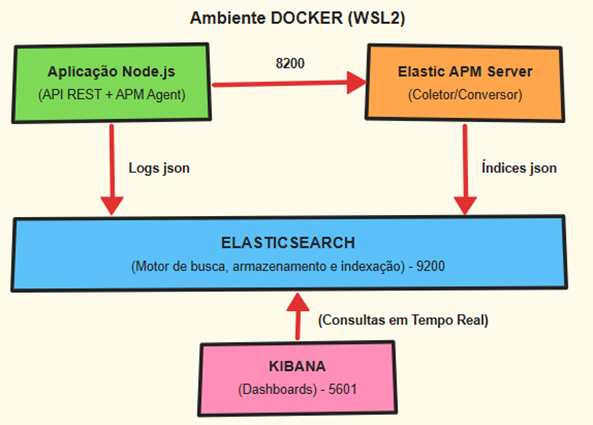

# Projeto de Observabilidade com a Stack Elastic e Node.js

Este repositório contém o código-fonte, o arquivo de orquestração e as instruções para implantar um Projeto Básico de Observabilidade com a Stack Elastic (Elasticsearch, Kibana e APM Server), monitorando uma API REST em Node.js/Express.

**Contexto acadêmico:** trabalho prático e artigo técnico da disciplina *Gerenciamento e Monitoramento de Aplicações e Infraestrutura*, Especialização em Engenharia DevOps, Instituto Federal de Mato Grosso (IFMT).

> **Aviso:** o ambiente foi montado apenas para laboratório (nó único, rede local). A autenticação do Elasticsearch/Kibana está desativada (`xpack.security.enabled=false`) e o APM Server aceita conexões anônimas (`apm-server.auth.anonymous.enabled=true`). **Não use esta configuração em produção.**

## Arquitetura da solução

O diagrama mostra os containers (Docker Compose no WSL2) e o fluxo de telemetria entre a aplicação Node.js, o APM Server, o Elasticsearch e o Kibana. A API roda diretamente no WSL2, fora dos containers.



## Estrutura do repositório

```
.
├── api/                         # API REST em Node.js/Express
│   ├── server.js                # Entrypoint e inicialização do agente APM
│   ├── package.json             # Dependências: express, elastic-apm-node, winston
│   └── package-lock.json        # Versões fixadas das dependências
├── elastic-stack/
│   └── docker-compose.yml       # Elasticsearch, Kibana e APM Server
├── arquitetura_ferramenta.png   # Diagrama de arquitetura
└── README.md
```

## Tecnologias e versões

| Componente | Versão / detalhe |
|---|---|
| Sistema | Windows 11 Pro, WSL2 com Ubuntu 22.04 LTS |
| Node.js | v18.19.1 |
| Express | ^5.2.1 |
| Winston | ^3.19.0 (logs em JSON no console) |
| Agente | `elastic-apm-node` 4.18.0 (ECS 8.10.0) |
| Elastic Stack | 8.12.2 (Elasticsearch, Kibana, APM Server) |
| Docker | Engine v24.0+ e Compose v2.20+ |
| Gerador de carga | autocannon (instalação global; versão: `autocannon --version`) |

Portas: Elasticsearch `9200`, APM Server `8200`, Kibana `5601`, API `3000`.
Rede Docker: `elastic` (bridge).

## Limites de recursos do WSL2

O Elasticsearch roda com heap de JVM fixado em 512 MB (`-Xms512m -Xmx512m`). Para evitar que o WSL2 consuma toda a memória do Windows, foi usado o arquivo `.wslconfig` abaixo, salvo em `C:\Users\<usuario>\.wslconfig`:

```ini
[wsl2]
memory=6GB
processors=4
swap=2GB
```

Depois de criar ou alterar o arquivo, reinicie o WSL: `wsl --shutdown`.

## Endpoints da API

| Rota | Método | Comportamento | Status |
|---|---|---|---|
| `/` | GET | Página inicial de teste | 200 |
| `/api/sucesso` | GET | Transação rápida e de baixa latência | 200 |
| `/api/lento` | GET | Span manual `consulta_banco_dados_ficticio` com atraso de 1,5 s (1.500 ms) | 200 |
| `/api/erro` | GET | Falha simulada, tratada em `try/catch`, registrada em log e reportada ao APM com `captureError` (com stack trace) | 500 |

Cada requisição gera um log JSON (Winston) no console com método, URL e `trace_id`. Esses logs **não** são enviados ao Elasticsearch; o `trace_id` é incluído manualmente no código.

## Como executar

### Pré-requisitos

- Docker Engine e Docker Compose (recomendado: WSL2 no Windows, ou Ubuntu 22.04+).
- Node.js 18+ e NPM.

### 1. Subir a Stack Elastic

```bash
cd elastic-stack
docker compose up -d
docker compose ps        # os três containers devem estar "Up"
```

Aguarde de 3 a 5 minutos e valide:

- Elasticsearch: <http://localhost:9200/>
- Kibana: <http://localhost:5601/>

### 2. Iniciar a API

Em outro terminal:

```bash
cd api
npm install
npm start                # equivale a: node server.js
```

O console exibirá o log do agente `elastic-apm-node` (conexão com `http://localhost:8200`) e a mensagem de que a API está na porta 3000.

### 3. Gerar carga

```bash
# Instalar o autocannon globalmente (se necessário)
npm install -g autocannon

# Rota de erro: 10 conexões, 1.000 requisições
autocannon -c 10 -a 1000 http://localhost:3000/api/erro

# Rota com gargalo: 5 conexões por 30 s
autocannon -c 5 -d 30 http://localhost:3000/api/lento

# Rota de sucesso (exemplo; ajuste aos parâmetros realmente usados)
autocannon -c 10 -a 1000 http://localhost:3000/api/sucesso
```

No experimento foram feitas várias execuções com parâmetros diferentes, para gerar informações na ferramenta. 

<!-- Preencher: comando, rota e horário de cada execução. -->

## Visualização no Kibana

Os dados aparecem em **Observability → APM → Services → `api-teste-observabilidade`**:

- **Transactions → `GET /api/lento`**: waterfall com o span `consulta_banco_dados_ficticio`.
- **Errors**: grupo de erros de `/api/erro`, com mensagem, culprit e stack trace.

O dashboard do artigo (throughput por rota, latência média, duração das requisições com falha e resumo por rota) foi montado no **Kibana Lens**.

<!-- Preencher: passos usados para criar os Data Views e os ajustes de mappings/fielddata citados no artigo,
     ou exportar o dashboard em Stack Management > Saved Objects (.ndjson) e versionar em docs/. -->

## Limitações conhecidas

- Segurança desativada e rede local: apenas para laboratório.
- Os logs ficam no console e não são correlacionados automaticamente aos traces no Elasticsearch.
- A aplicação é um único serviço; o experimento não demonstra rastreamento entre múltiplos serviços.
